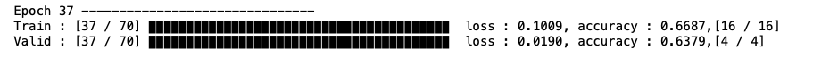
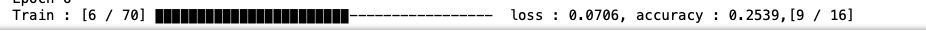
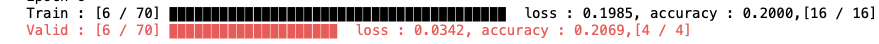

# Progress Bar








## How To Use

### 1. install the module
```bash
pip3 install jhpbar
```

### 2. declare pbar
```python
from jhpbar import jhpbar
j = jhpbar(steps=10, size=20, prefix='Prefix!', postfix='Postfix!', color=1)
```

### 3. update pbar
```python
import time
for i in range(10):
    j.update(1)
    time.sleep(1)
```

the progress bar will be filled
```bash
Prefix! ▉▉▉▉▉▉▉▉▉▉▉▉▉▉▉▉▉▉▉▉ Postfix!
```

### 4. reset pbar
```python
j.reset()
```


## Docs

### jhpbar(size=Integer, steps=Integer, prefix = String, postfix = String, color = [0,3])
#### init parameter
1. steps (required) : progress total size (logical size)
2. size (default=20) : The size shown on the screen. (phcsical size)
3. prefix (default='') : prefix
4. postfix (default='') : postfix
5. color (default=0) : color
    0 : None
    1 : Red
    2 : green
    3 : blue


### jhpbar.update(count=Integer, prefix=String, postfix=String)
update the progress bar
#### parameter
1. count (default = 1) : Fill the progress bar by count 
2. prefix, postfix (default = '')

### jhpbar.reset()
reset the progress bar
#### parameter
1. progress (default=1) : reset the progress(logical step)
2. prefix, postfix (default='')
 

## Sample Code
```python
from jhpbar import jhpbar
j = jhpbar(steps=10, size=20, prefix='Prefix!', postfix='Postfix!', color=1)

import time
for i in range(10):
    j.update(1)
    time.sleep(1)
```
 
